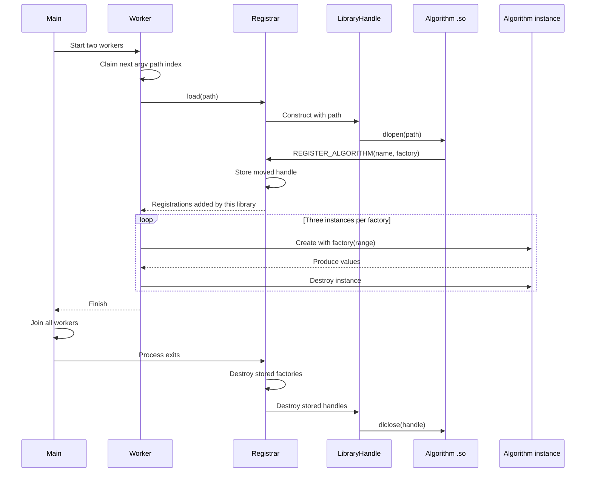

# Recitation 9: Dynamic Loading

This example loads algorithm `.so` files at runtime. Each library registers one or more factories, and each factory receives an integer range and creates an algorithm.

The registrar owns private, move-only `LibraryHandle` objects until process exit. Each handle pairs `dlopen()` with `dlclose()`. Threaded mode has exactly two workers. Each worker claims the next argv path, loads that library, and creates three short-lived instances from every factory it registered.

## Threaded plugin lifecycle



The registrar briefly serializes `dlopen()` and registration capture so concurrent workers cannot mix up factories. Factory calls and algorithm execution happen after that lock is released. If loading fails before a handle is stored, its local `LibraryHandle` still closes it automatically.

`SlowRandomAlgorithm` waits 250 ms before returning each deterministic pseudo-random value, making the difference between sequential and threaded execution visible.

## Build

```bash
cmake -S recitation_9_files -B recitation_9_files/build
cmake --build recitation_9_files/build
```

## Live examples

```bash
# One library
./recitation_9_files/build/algorithm_demo 1 3 \
  ./recitation_9_files/build/ConstAlgorithm.so

# Three libraries, loaded and run sequentially
./recitation_9_files/build/algorithm_demo 1 3 \
  ./recitation_9_files/build/ConstAlgorithm.so \
  ./recitation_9_files/build/CyclingAlgorithm.so \
  ./recitation_9_files/build/SlowRandomAlgorithm.so

# Two workers share the library paths
./recitation_9_files/build/algorithm_demo 1 3 --threads \
  ./recitation_9_files/build/ConstAlgorithm.so \
  ./recitation_9_files/build/CyclingAlgorithm.so \
  ./recitation_9_files/build/SlowRandomAlgorithm.so

# One library containing two registered algorithms
./recitation_9_files/build/algorithm_demo 1 3 \
  ./recitation_9_files/build/CombinedAlgorithms.so
```

Run the positive and failure checks with:

```bash
ctest --test-dir recitation_9_files/build --output-on-failure
```
